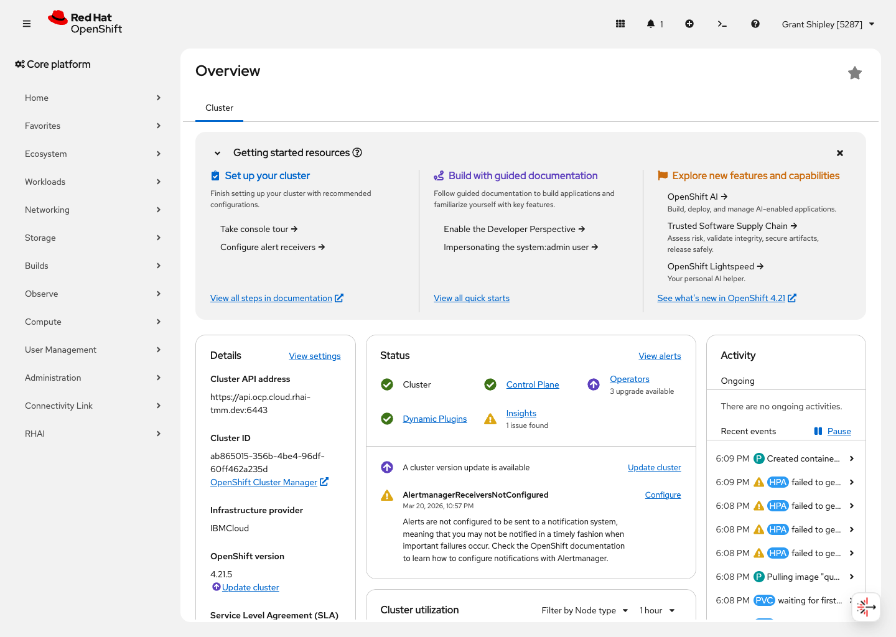
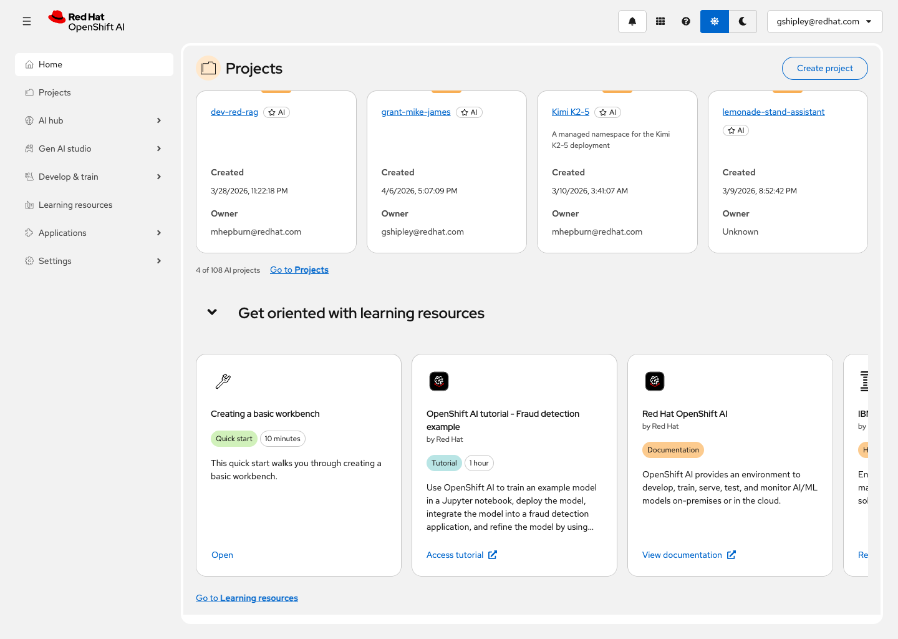
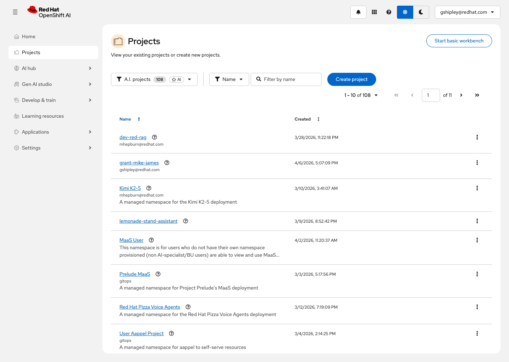
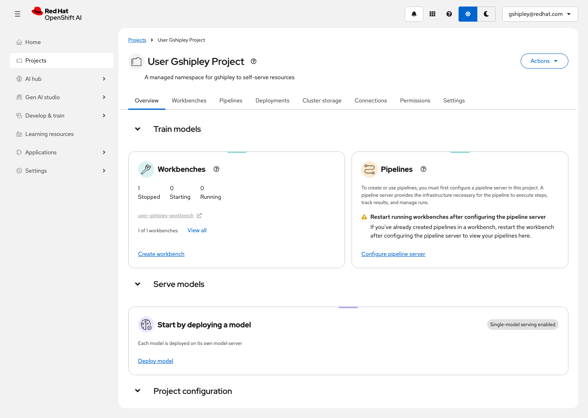
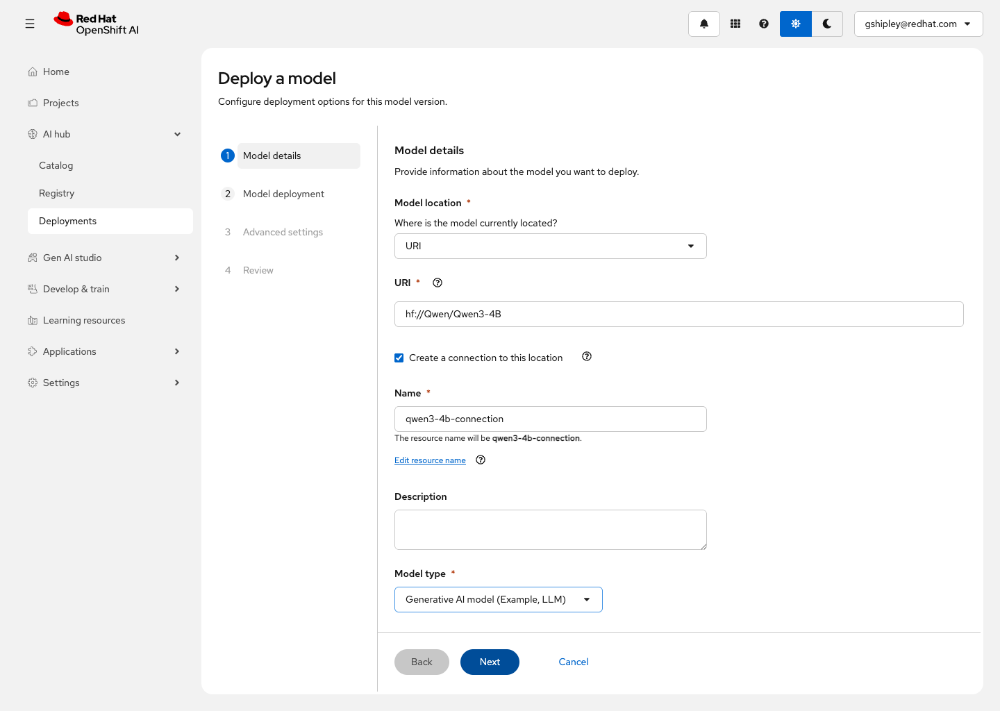
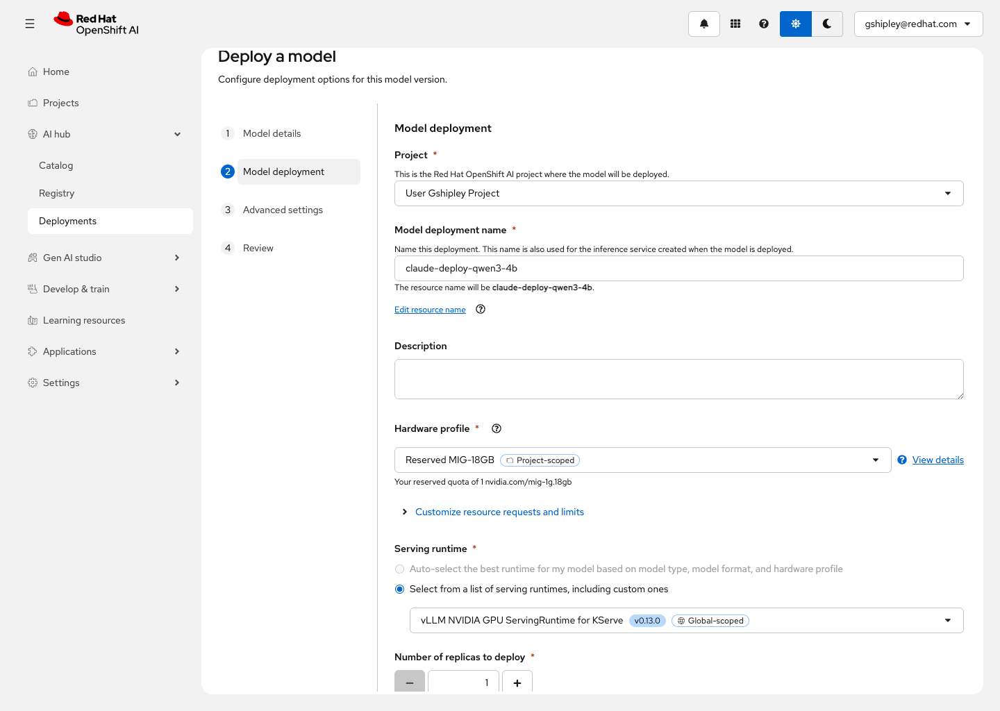
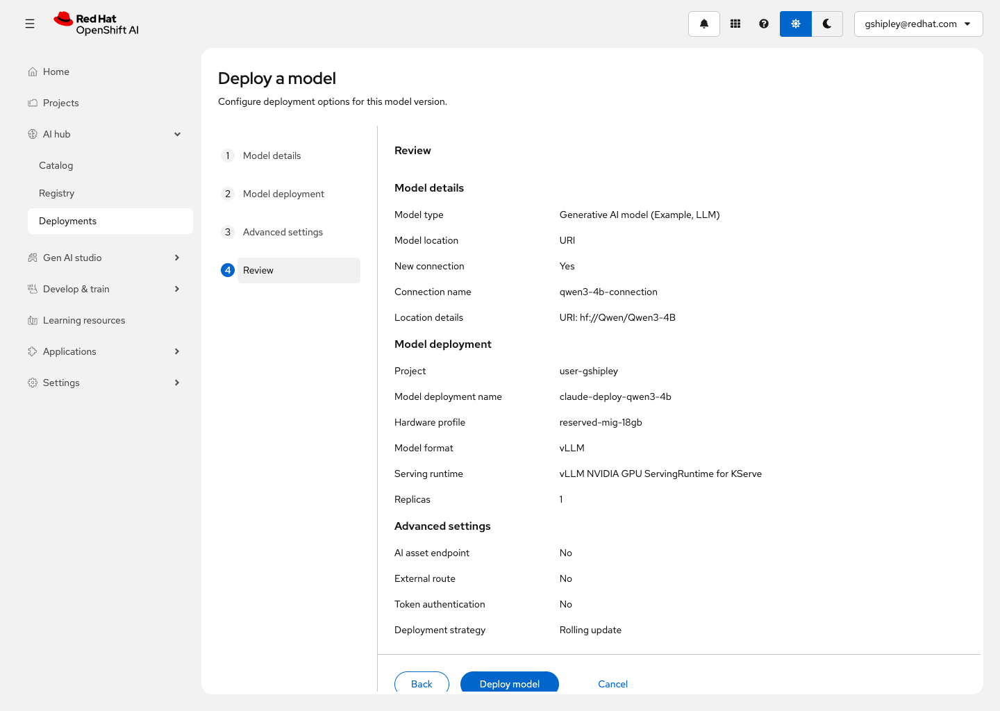
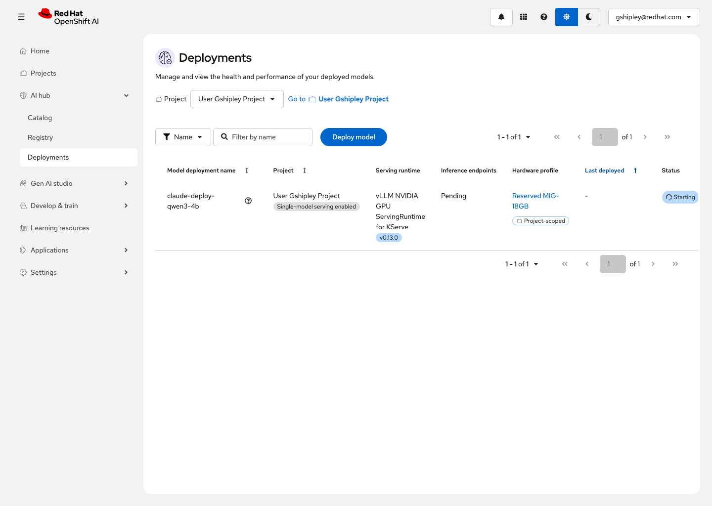
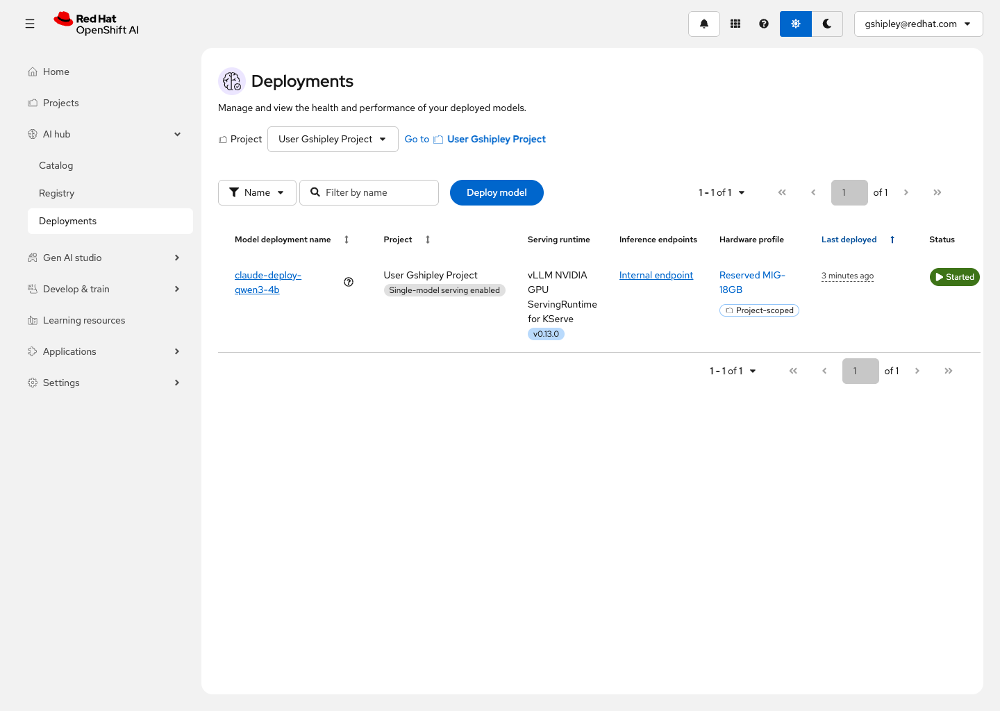

# Deploy a Model on OpenShift AI

Deploy the Qwen 3 4B large language model from Hugging Face on Red Hat OpenShift AI. This workshop walks you through every step of the process, from finding the OpenShift AI dashboard to verifying that your model is up and serving requests.

## Audience

- Developers or data scientists deploying a model on OpenShift AI for the first time.
- Platform engineers who want to understand the model-serving workflow end to end.
- Solution architects evaluating OpenShift AI as a model deployment platform.
- Workshop facilitators or technical sellers preparing a live demo.

## Estimated Time

- 25 minutes

## Objectives

- Navigate from the OpenShift console to the OpenShift AI dashboard.
- Locate your project inside the OpenShift AI dashboard.
- Deploy the Qwen 3 4B model from Hugging Face using the guided deployment wizard.
- Select a GPU hardware profile and an appropriate serving runtime.
- Submit the deployment and confirm it was accepted.
- Validate that the deployed model reaches a running state and has an active inference endpoint.

## Prerequisites

- Access to a non-production environment running Red Hat OpenShift AI 3.3 (`rhai-3.3`).
- A user account with permission to access the OpenShift AI dashboard and deploy models in the `user-gshipley` project.
- At least one compatible GPU hardware profile available for model serving.
- Outbound network connectivity from the cluster to Hugging Face, or an equivalent mirrored model source if your environment is air-gapped.
- Workshop configuration in `capture/workshop-config.toml`.

## What You Will Learn

- How the OpenShift console and the OpenShift AI dashboard relate to each other, and how to move between them.
- What an OpenShift AI project is and how it organizes your model-serving resources.
- What each field in the model deployment wizard does and why it matters.
- What a serving runtime and a hardware profile are, and how they determine where and how your model runs.
- How to deploy a model and confirm that it reaches a running state with an active inference endpoint.

## Key Concepts

If you are new to model serving, here are a few terms that will come up throughout this workshop.

**Model**: A file (or set of files) containing the learned weights and configuration that allow software to make predictions or generate text. In this workshop, the model is Qwen 3 4B, a generative large language model with approximately four billion parameters.

**Parameters**: The numeric weights inside a model that were learned during training. The number of parameters is a rough indicator of model size and capability. A 4B (four billion) parameter model is large enough to produce useful text generation but small enough to fit comfortably in a workshop-sized GPU allocation.

**Serving runtime**: The software that loads a model into memory and exposes it as an API endpoint so that applications can send requests and receive responses. This workshop uses the vLLM NVIDIA GPU ServingRuntime for KServe, which is optimized for running large language models on NVIDIA GPUs.

**Hardware profile**: A named configuration that defines how much compute capacity (CPU, memory, and GPU) is allocated to your model deployment. The hardware profile determines the size of the resource "slice" your model gets on the cluster.

**Inference**: The process of sending input to a deployed model and receiving a prediction or generated output in return. Once your model is deployed and running, applications interact with it by sending inference requests to its endpoint.

**Project**: An organizational boundary in OpenShift AI that groups related resources together, including workbenches, model deployments, pipelines, connections, and storage. Think of it as a workspace for a team or a specific initiative.

**Context window (max model length)**: The maximum number of tokens a model can process in a single request, including both the input prompt and the generated response. A larger context window requires more GPU memory for the KV cache. When deploying on a constrained GPU slice, you may need to reduce the context window to fit within available memory.

**KV cache**: A block of GPU memory that the serving runtime allocates to store intermediate computation results (key and value tensors) during text generation. The KV cache size is proportional to the context window length — a longer context window requires a larger KV cache, which consumes more GPU memory.

## Environment

- Product: `rhai-3.3`
- OpenShift Console URL: `https://console-openshift-console.apps.ocp.cloud.rhai-tmm.dev/`
- OpenShift AI Dashboard URL: `https://data-science-gateway.apps.ocp.cloud.rhai-tmm.dev/`
- Project: `User Gshipley Project` (`user-gshipley`)
- Model: `Qwen 3 4B`
- Model URI: `hf://Qwen/Qwen3-4B`
- Hardware profile: `Reserved MIG-18GB`
- Serving runtime: `vLLM NVIDIA GPU ServingRuntime for KServe`
- Max model length: `32768` tokens (reduced from the default 40960 to fit within the 18 GB MIG slice)
- Config file: `capture/workshop-config.toml`
- Capture session: `pw-claude-deploy`

## Lab Steps

### 1. Find the OpenShift AI dashboard from the OpenShift console (2 minutes)

Before you can deploy a model, you need to know how to reach the OpenShift AI dashboard. If your administrator has given you a direct URL to the dashboard, you can use it. But in many environments, the most reliable way to find OpenShift AI is to start from the main OpenShift console and navigate from there.

Open the OpenShift console at `https://console-openshift-console.apps.ocp.cloud.rhai-tmm.dev/`. If you are prompted to log in, complete the authentication flow for your environment.

Once you are on the console landing page, look at the left-hand navigation panel. Depending on your cluster configuration, you will see an entry for **Red Hat OpenShift AI** in the navigation. This is the link that takes you from the general-purpose OpenShift console into the dedicated AI dashboard.

Click the **Red Hat OpenShift AI** link. This opens the OpenShift AI dashboard in the same browser window (or in a new tab, depending on your cluster configuration).

Why start here? In a real environment, you may not always have the dashboard URL bookmarked. Knowing how to find OpenShift AI from the main console is a practical skill that will save you time, especially when you are working in a new cluster or helping a colleague get started.



Expected result: you can see the OpenShift console and identify the navigation entry for Red Hat OpenShift AI.

### 2. Orient yourself on the OpenShift AI dashboard (3 minutes)

After clicking the OpenShift AI link, you arrive at the dashboard home page. This is the central starting point for all AI and machine-learning work on the cluster.

Take a moment to look at the layout before clicking anything:

- **Left navigation**: The sidebar contains links to the major sections of OpenShift AI. You will see entries such as `Home`, `Projects`, `AI hub`, `Gen AI studio`, `Develop & train`, `Learning resources`, `Applications`, and `Settings`. Each of these sections maps to a different capability or workflow within the platform.
- **Center content area**: The home page highlights recent activity, projects, and quick-start actions. It is designed to help you get to work quickly rather than making you search through menus.
- **Top bar**: Shows the current user, cluster context, and access to help resources.

For this workshop, the section that matters most is **Projects**. A project in OpenShift AI is the workspace where you organize all the resources for a specific initiative. Model deployments, workbenches, pipelines, connections, and storage all live inside a project. When you deploy a model, you deploy it into a specific project.

Understanding the dashboard layout now will make every future task faster. Instead of hunting for buttons, you will know exactly where each workflow lives.



Expected result: you can identify the main navigation sections in the OpenShift AI dashboard and understand that the home page is an orientation surface, not just a welcome screen.

### 3. Navigate to your project (3 minutes)

Click **Projects** in the left navigation. This page shows all of the OpenShift AI projects that are available to your user account.

In a shared environment, this list may contain many projects belonging to different teams or individuals. To find the project you need, use the **Filter by name** field at the top of the list.

Type `User Gshipley` into the filter. The list narrows to show `User Gshipley Project`. Click on the project name to open it.

You are now on the project overview page. This is the workspace where you will deploy the model. Before continuing, notice the tabs along the top of the project page:

- **Overview**: A summary of everything in the project, including sections for workbenches, pipelines, model deployments, and more.
- **Workbenches**: Interactive development environments (notebooks) for experimentation and development.
- **Pipelines**: Automated workflows for training, processing, or deploying models.
- **Deployments**: Where your model deployments will appear after you create them.
- **Cluster storage**: Persistent storage volumes available to resources in this project.
- **Connections**: External data sources, model registries, and other integrations.
- **Permissions**: Access control for the project.
- **Settings**: Project-level configuration.

The tab you will use most in this workshop is **Deployments**, but the deployment process starts from the **Overview** tab.



Expected result: you can locate your project using the filter and open the project overview page.

### 4. Find the Deploy model action (2 minutes)

On the project overview page, scroll down to the **Serve models** section. This section shows any existing model deployments in the project and provides the entry point for creating new ones.

In this environment, the Serve models section confirms that **single-model serving** is enabled and displays a **Deploy model** button. Single-model serving means that each deployment hosts exactly one model behind its own dedicated endpoint. This is the simplest and most common serving mode for getting started.

Click **Deploy model**. This opens the deployment wizard, which will walk you through the configuration step by step.

If you do not see the Deploy model button, check that single-model serving is enabled for this project and that your user account has permission to deploy models. Your administrator may need to configure the serving platform before this action becomes available.



Expected result: you can see the Serve models section on the project overview and click Deploy model to enter the deployment wizard.

### 5. Enter the model source details (3 minutes)

The first step of the deployment wizard is **Model details**. This is where you tell OpenShift AI where the model files are located and what kind of model you are deploying.

Configure the following fields:

| Field | Value | Why |
|-------|-------|-----|
| **Model location** | `URI` | Tells OpenShift AI to pull the model directly from a remote source using a URI, rather than from a pre-registered model catalog or local storage. |
| **URI** | `hf://Qwen/Qwen3-4B` | The Hugging Face address for the Qwen 3 4B model. The `hf://` prefix tells the serving runtime to download the model from the Hugging Face model hub. |
| **Create a connection to this location** | Enabled (default) | Creates a reusable connection record so that OpenShift AI can access this model source again in the future without re-entering the details. |
| **Connection name** | `qwen3-4b-connection` | A human-readable name for the connection. Use something descriptive so you can recognize it later. |
| **Model type** | `Generative AI model (Example, LLM)` | Tells OpenShift AI that this is a large language model designed for text generation, which influences the serving options available in the next step. |

After filling in these fields, the wizard validates the configuration. If everything is accepted, the **Next** button becomes active.

A note on the model URI: the `hf://Qwen/Qwen3-4B` format is a convenient shorthand. When the serving runtime starts, it downloads the model weights and configuration files directly from Hugging Face. This means your cluster needs outbound internet access to Hugging Face. In restricted or air-gapped environments, you would use a different URI pointing to an internal model mirror.



Expected result: the wizard accepts the Qwen 3 4B URI and the next step becomes available.

### 6. Configure the deployment settings (3 minutes)

Click **Next** to move to the **Model deployment** step. This is where you configure how and where the model will run.

Configure the following fields:

| Field | Value | Why |
|-------|-------|-----|
| **Project** | `User Gshipley Project` | The project where OpenShift AI will create the deployment resources. This determines the namespace, permissions, and resource boundaries. |
| **Model deployment name** | `claude-deploy-qwen3-4b` | A unique name for this deployment. You will use this name to find the deployment in the dashboard, in API calls, and in monitoring tools. |
| **Hardware profile** | `Reserved MIG-18GB` | Allocates a reserved GPU memory slice for the Qwen 3 4B model. This is your dedicated quota of one `nvidia.com/mig-1g.18gb` device, which provides sufficient room for a 4-billion-parameter model to load its weights and serve inference requests. Using a reserved profile guarantees availability rather than competing for unreserved cluster resources. |
| **Serving runtime** | `vLLM NVIDIA GPU ServingRuntime for KServe` | The software stack that will load the model and handle inference. vLLM is a high-performance inference engine optimized for large language models on NVIDIA GPUs. |
| **Number of replicas** | `1` | How many copies of the serving pod to create. One replica is sufficient for a workshop or development environment. Production deployments may use more replicas for availability and throughput. |

Understanding these fields is the most important part of the workshop. Here is what is happening behind the scenes when you make these selections:

- **Project** determines the Kubernetes namespace where OpenShift AI creates the serving pod, the inference service, and the supporting resources. Everything stays inside this boundary.
- **Deployment name** is the label that ties all of these resources together. It appears in the dashboard, in `oc` commands, and in API responses.
- **Hardware profile** controls the GPU allocation. Qwen 3 4B has approximately four billion parameters, and each parameter is typically stored as a 16-bit floating-point number. That works out to roughly 8 GB of raw model weight data, plus additional memory for the serving runtime, KV cache (the memory used during text generation to store previously computed attention values), and operating overhead. The Reserved MIG-18GB profile gives you a dedicated 18 GB GPU slice from your project-scoped quota, which provides comfortable headroom for this model.
- **Serving runtime** is the engine that actually does the work. vLLM uses techniques like PagedAttention and continuous batching to serve multiple concurrent requests efficiently. KServe is the serving framework that manages the lifecycle of the inference service on Kubernetes.
- **Replicas** controls availability. With one replica, there is a single pod handling all requests. If that pod restarts, the model is temporarily unavailable. For a workshop, one replica keeps things simple and conserves GPU resources.



Expected result: all deployment settings are filled in and the wizard allows you to continue.

### 7. Review and submit the deployment (2 minutes)

Click **Next** to reach the **Review** step. This page shows a summary of everything you configured in the previous steps. Read through each section and confirm that the values match what you entered:

- **Model type**: Generative AI model
- **Model URI**: `hf://Qwen/Qwen3-4B`
- **Connection name**: `qwen3-4b-connection`
- **Project**: `user-gshipley`
- **Deployment name**: `claude-deploy-qwen3-4b`
- **Hardware profile**: `Reserved MIG-18GB`
- **Serving runtime**: `vLLM NVIDIA GPU ServingRuntime for KServe`
- **Replicas**: `1`

The review screen is your last chance to catch configuration errors before OpenShift AI starts creating resources. Fixing a mistake now takes a few seconds. Fixing it after deployment means deleting the deployment and starting over.

If you left the **Advanced settings** at their defaults, the deployment will not expose an external route or require token authentication. This is fine for a workshop environment. In a production deployment, you would typically enable both for security and accessibility.

Once you have confirmed the settings, click **Deploy model**.



Expected result: the review page shows the correct configuration and you can click Deploy model to submit.

### 8. Deploy the model and adjust the context window (5 minutes)

After clicking **Deploy model**, OpenShift AI accepts the deployment request and redirects you to the **Deployments** page for your project. Your new deployment, `claude-deploy-qwen3-4b`, appears in the list immediately.

At this point, the deployment begins its startup lifecycle. You can see the current status in the **Status** column of the deployments table.



#### Why the deployment needs a context window adjustment

Qwen 3 4B ships with a default maximum sequence length of 40,960 tokens. When the vLLM serving runtime starts, it allocates a KV cache — a block of GPU memory used during text generation to store previously computed attention values for each token in the conversation. The default sequence length requires approximately 5.6 GB of KV cache, but the Reserved MIG-18GB slice only has about 5.3 GB of GPU memory available after loading the model weights and the runtime itself.

This means the deployment will fail on its first attempt with a `ValueError` indicating that the KV cache requirement exceeds available memory. This is normal and expected when fitting a model tightly into a GPU slice. The fix is straightforward: reduce the maximum context window to a size that fits within the available memory.

A maximum model length of 32,768 tokens (32K) is a practical choice. It is large enough for most conversational and generation tasks, and it reduces the KV cache requirement to fit comfortably within the 18 GB MIG slice. For reference, 32K tokens is roughly equivalent to 50 pages of text, which is more than sufficient for a workshop environment.

#### Apply the fix

After the deployment appears in the list, use the OpenShift CLI (`oc`) to patch the InferenceService with the `--max-model-len` argument. This tells vLLM to cap the context window at 32,768 tokens instead of the default 40,960:

```bash
oc patch inferenceservice claude-deploy-qwen3-4b \
  -n user-gshipley \
  --type=merge \
  -p '{"spec":{"predictor":{"model":{"args":["--max-model-len","32768"]}}}}'
```

After patching, OpenShift AI automatically rolls out a new serving pod with the updated configuration. The old pod (which was failing due to the memory error) is replaced by a new pod that starts with the reduced context window.

You can verify the rollout is happening by checking the pod status:

```bash
oc get pods -n user-gshipley -l serving.kserve.io/inferenceservice=claude-deploy-qwen3-4b
```

You should see the old pod terminating and a new pod starting up. The new pod goes through the same lifecycle phases:

1. **Init**: The pod initializes and prepares the container environment.
2. **Downloading**: The serving runtime pulls the Qwen 3 4B model files from Hugging Face (this may be faster if the files are already cached on the node).
3. **Loading**: The serving runtime loads the model weights into GPU memory and allocates the KV cache within the reduced 32K context window.
4. **Running**: The model is fully loaded and the inference endpoint is active.

Expected result: the `oc patch` command succeeds, and a new pod begins starting with the `--max-model-len 32768` argument.

### 9. Validate the deployment is running (3 minutes)

Return to the **Deployments** page in the OpenShift AI dashboard and refresh the page. Watch the **Status** column for `claude-deploy-qwen3-4b` to change from **Starting** to **Running**. Depending on how quickly the model downloads and loads, this can take anywhere from two to ten minutes after the patch.

Once the status changes to **Running**, the deployment is live and the model is accepting inference requests. The **Inference endpoints** column in the deployments table will show the endpoint URL where applications can send requests to the model.

To confirm that the deployment is healthy:

1. Verify that the **Status** column shows **Running** (not Starting, Failed, or Error).
2. Note the **Inference endpoints** value. This is the URL that applications use to send prompts to the model and receive generated text in response.
3. Optionally, click the deployment name to open its detail page and review the full configuration, resource usage, and endpoint information.

You can also verify from the command line that the InferenceService is ready:

```bash
oc get inferenceservice claude-deploy-qwen3-4b -n user-gshipley
```

Look for `READY: True` in the output, which confirms the model is loaded and the endpoint is accepting traffic.

A running deployment means that:

- The model files were successfully downloaded from Hugging Face.
- The vLLM serving runtime loaded the model weights into GPU memory on the Reserved MIG-18GB slice.
- The KV cache was allocated within the 32K token context window.
- KServe created the inference service and the endpoint is accepting traffic.
- Applications in the cluster can now send OpenAI-compatible API requests to the model's endpoint and receive generated text responses.



Expected result: `claude-deploy-qwen3-4b` shows a **Running** status on the Deployments page, confirming that the Qwen 3 4B model is fully deployed and serving inference requests.

## Validation

Use this checklist to confirm that you completed the workshop successfully:

- [ ] You navigated from the OpenShift console to the OpenShift AI dashboard.
- [ ] You located the `User Gshipley Project` using the projects filter.
- [ ] You opened the deployment wizard from the project overview page.
- [ ] You entered `hf://Qwen/Qwen3-4B` as the model source URI.
- [ ] You selected the `Reserved MIG-18GB` hardware profile.
- [ ] You selected the `vLLM NVIDIA GPU ServingRuntime for KServe` serving runtime.
- [ ] You reviewed the deployment configuration on the Review step.
- [ ] You clicked Deploy model and the deployment was submitted successfully.
- [ ] You confirmed that `claude-deploy-qwen3-4b` appears in the deployment list with the correct settings.
- [ ] You patched the InferenceService with `--max-model-len 32768` to fit the context window within the 18 GB MIG slice.
- [ ] You verified that the new pod started successfully after the patch.
- [ ] You waited for the deployment status to change from Starting to Running.
- [ ] You identified the inference endpoint URL for the deployed model.

## Cleanup

- Delete the `claude-deploy-qwen3-4b` deployment after the workshop if you do not want to continue consuming GPU resources. Open the deployment in the dashboard, use the action menu, and select **Delete**.
- Remove the `qwen3-4b-connection` connection from the project if it was created only for this workshop.
- If you are running this workshop repeatedly for different audiences, delete the previous deployment before starting a new session to avoid name conflicts and unnecessary resource consumption.

## Troubleshooting

| Symptom | Likely Cause | Action |
|---------|-------------|--------|
| No Deploy model button on the project overview | Single-model serving is not enabled for this project | Ask your administrator to enable the model serving platform for the project |
| Wizard does not accept the model URI | Typo in the URI or the `hf://` prefix is missing | Verify the URI is exactly `hf://Qwen/Qwen3-4B` |
| Deployment stays in Starting state for more than 10 minutes | GPU resources may not be available on the cluster | Check with your administrator that the cluster has available GPU capacity matching the selected hardware profile |
| Deployment shows a pull error | Cluster cannot reach Hugging Face | Verify outbound network connectivity or use an internal model mirror |
| Deployment fails immediately after creation | Hardware profile or serving runtime mismatch | Confirm that the selected serving runtime supports the hardware profile and model type |
| Pod crashes with `ValueError: KV cache is needed, which is larger than the available KV cache memory` | The model's default context window (40,960 tokens) exceeds the GPU memory available for KV cache on the MIG slice | Patch the InferenceService with `--max-model-len 32768` as described in step 8 |
| Pod stays in `Init` or `ContainerCreating` after the patch | The new pod is downloading the model or waiting for the GPU to become available | Check pod events with `oc describe pod <pod-name> -n user-gshipley` and wait for the download to complete |
