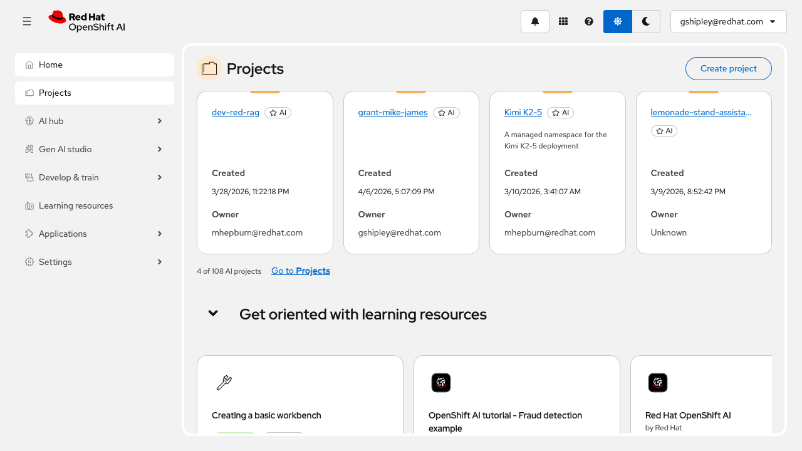
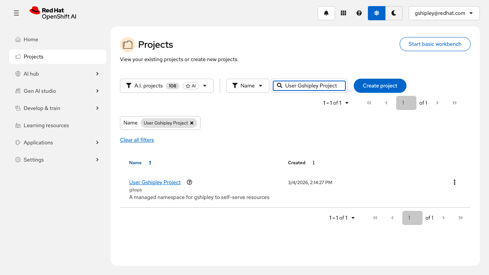
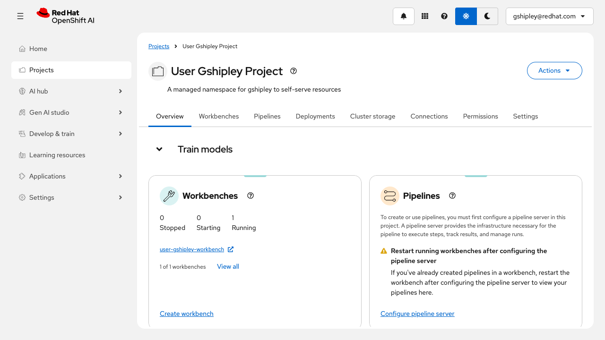
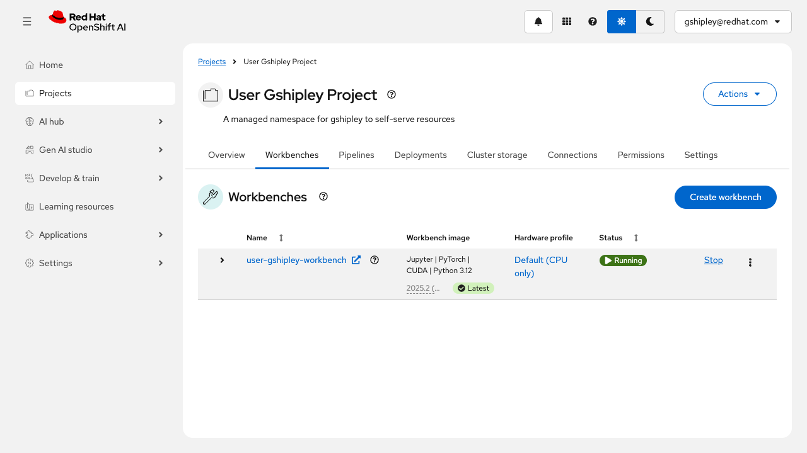

# OpenShift AI 3.3 Dashboard Basics

This workshop provides a guided introduction to the OpenShift AI dashboard in a live Red Hat OpenShift AI 3.3 environment. Over the course of about 20 minutes, you will move from the dashboard landing page into the project experience and finish by reviewing a running workbench.

The goal is not to build a model or create new resources. Instead, this lab helps you learn how the dashboard is organized, what the main navigation surfaces are used for, and where to look when you want to begin working inside an AI project.

## Audience

- Platform engineers who need a quick orientation to the dashboard.
- Solution architects who want to understand how OpenShift AI presents projects and workbenches.
- Technical sellers or workshop facilitators preparing to demonstrate the product.

## Estimated Time

- 20 minutes

## Objectives

- Sign in to the OpenShift AI dashboard.
- Use the dashboard navigation to find AI projects.
- Open a project and explain what the Overview tab is showing.
- Review the Workbenches tab and interpret the status of a running workbench.
- Confirm the expected visual outcomes with real screenshots from the live environment.

## Prerequisites

- Access to a non-production environment for `rhai-3.3`.
- A user who can access the OpenShift AI dashboard and the target project.
- Workshop configuration in `capture/workshop-config.toml`.
- Saved browser auth state in `capture/auth-state.json` if you want to replay screenshot capture.

## What You Will Learn

- How to reach the OpenShift AI dashboard outside of the core OpenShift console.
- How the left navigation separates dashboard capabilities such as projects, AI hub, Gen AI studio, learning resources, and settings.
- How an AI project acts as the main workspace boundary for team resources.
- How to recognize an available workbench and understand the basic information shown in its row.

## Environment

- Product: `rhai-3.3`
- Dashboard URL: `https://data-science-gateway.apps.ocp.cloud.rhai-tmm.dev/`
- Project: `User Gshipley Project` (`user-gshipley`)
- Workbench: `user-gshipley-workbench`
- Config file: `capture/workshop-config.toml`
- Capture session: `pw-ai33-dashboard`

## Lab Steps

### 1. Open the OpenShift AI dashboard (5 minutes)

Open `https://data-science-gateway.apps.ocp.cloud.rhai-tmm.dev/`. If you are prompted to sign in, complete the configured identity-provider login flow for this environment.

After authentication, you land on the dashboard home page. This page is designed to orient users quickly and give them direct access to the most important OpenShift AI surfaces. In this environment, the left navigation includes `Home`, `Projects`, `AI hub`, `Gen AI studio`, `Develop & train`, `Learning resources`, `Applications`, and `Settings`.

Spend a minute scanning the page rather than clicking immediately. Notice that the home page is not just a static welcome screen. It highlights projects, learning resources, and operational shortcuts that help different personas get started. A platform engineer might jump to cluster-level settings, while a data scientist might head directly to a project or a workbench.

As you review the page, make note of these ideas:

- The left navigation is the fastest way to move between major product areas.
- The center of the page highlights current work rather than every possible feature.
- The home page is meant to reduce time to first action, whether that action is creating a project, opening a tutorial, or managing a workbench image.

Expected result: you can identify the main dashboard sections and explain that the home page is a navigation and orientation surface, not just a landing screen.

### 2. Review the projects inventory (5 minutes)

Select `Projects` in the left navigation. The projects page is where OpenShift AI presents project-level workspaces. A project is the boundary that groups related AI assets together, such as workbenches, pipelines, model deployments, connections, and permissions.

On this page, review the inventory controls at the top:

- The filter field helps you find a project quickly when the environment contains many projects.
- Pagination shows that this environment contains a larger shared catalog of AI projects.
- Action buttons such as `Start basic workbench` and `Create project` show common starting points for new work.

Use the `Filter by name` field to search for `User Gshipley Project`, then open that result. This is the fastest path to the project detail page when the full inventory spans multiple pages, and it is the most realistic workflow for shared demo or multi-user environments.

Expected result: you can explain what an AI project represents and use the filter controls to locate a specific project.

### 3. Open the target project (5 minutes)

Open `User Gshipley Project`. The project overview page shows the main dashboard surfaces for that project, including tabs for Overview, Workbenches, Pipelines, Deployments, Cluster storage, Connections, Permissions, and Settings.

This page is the best place to understand how OpenShift AI organizes day-to-day work inside a project. Instead of forcing users to navigate through many disconnected pages, the project view puts the most important capabilities behind a consistent set of tabs.

Stay on the `Overview` tab first and review what it communicates:

- `Workbenches` introduces the development environment used for notebooks and interactive experimentation.
- `Pipelines` points to the automation and repeatability side of model development.
- `Deployments` surfaces the model serving workflow.
- `Cluster storage`, `Connections`, and `Permissions` show that a project is not just for code. It is also where teams manage data access, secrets, collaboration, and supporting services.

This is a useful discussion point in a workshop because it shows that OpenShift AI treats a project as a full operational workspace, not merely a folder or namespace label.

Expected result: you can describe the purpose of the main project tabs and explain why the Overview page is a strong starting point for new users.

### 4. Inspect the project workbenches (5 minutes)

Select the `Workbenches` tab for `User Gshipley Project`. This page shows the available workbenches in the project, their images, hardware profiles, and current status.

In this environment, the `user-gshipley-workbench` entry is already running, which makes it a strong example for understanding how OpenShift AI exposes active development environments to the user.

Review the information shown in the workbench row:

- The workbench name is the primary entry point into the interactive environment.
- The workbench image tells you what software stack the session is based on.
- The hardware profile tells you what compute shape is assigned.
- The status shows whether the workbench is currently available.
- The action buttons, such as `Stop`, indicate that the dashboard can manage the workbench lifecycle directly.

This page is especially helpful for new users because it connects abstract OpenShift AI concepts to something concrete. A workbench is not just a backend resource; it is the place where many users actually do hands-on development work.

Expected result: you can identify a running workbench, explain what the row details mean, and describe this page as the operational view for interactive development environments.

## Validation

- The learner can reach the OpenShift AI dashboard home page.
- The learner can explain the purpose of the left navigation and the home page.
- The learner can navigate to `Projects`.
- The learner can open `User Gshipley Project`.
- The learner can summarize what the `Overview` tab is used for.
- The learner can verify that `user-gshipley-workbench` is visible and running on the `Workbenches` tab.

## Cleanup

- No cleanup is required for this read-only walkthrough.
