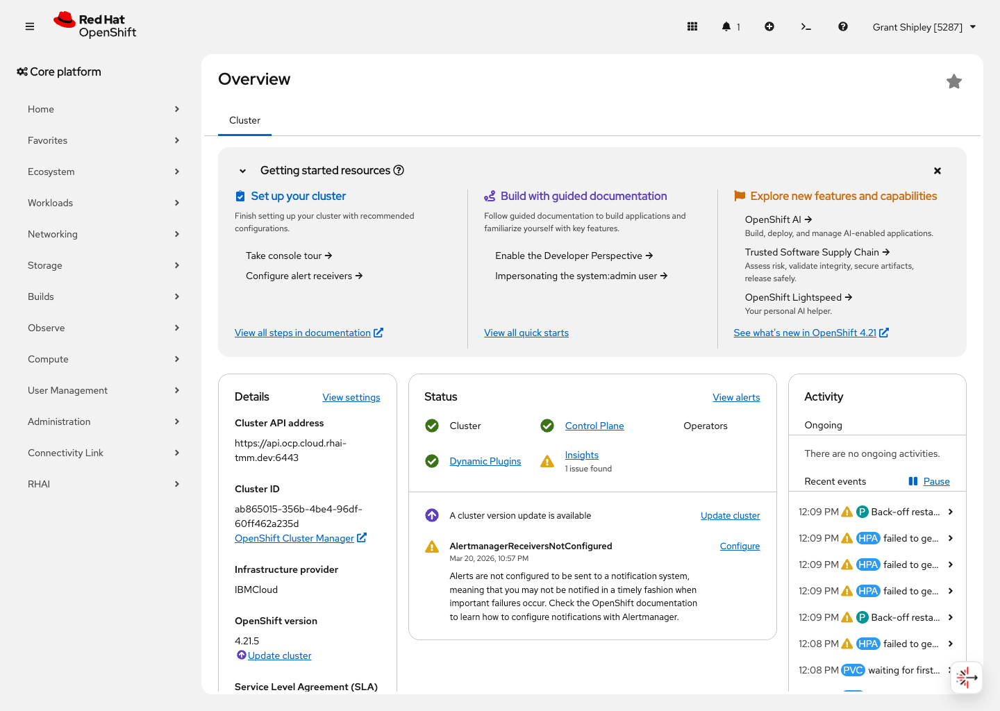
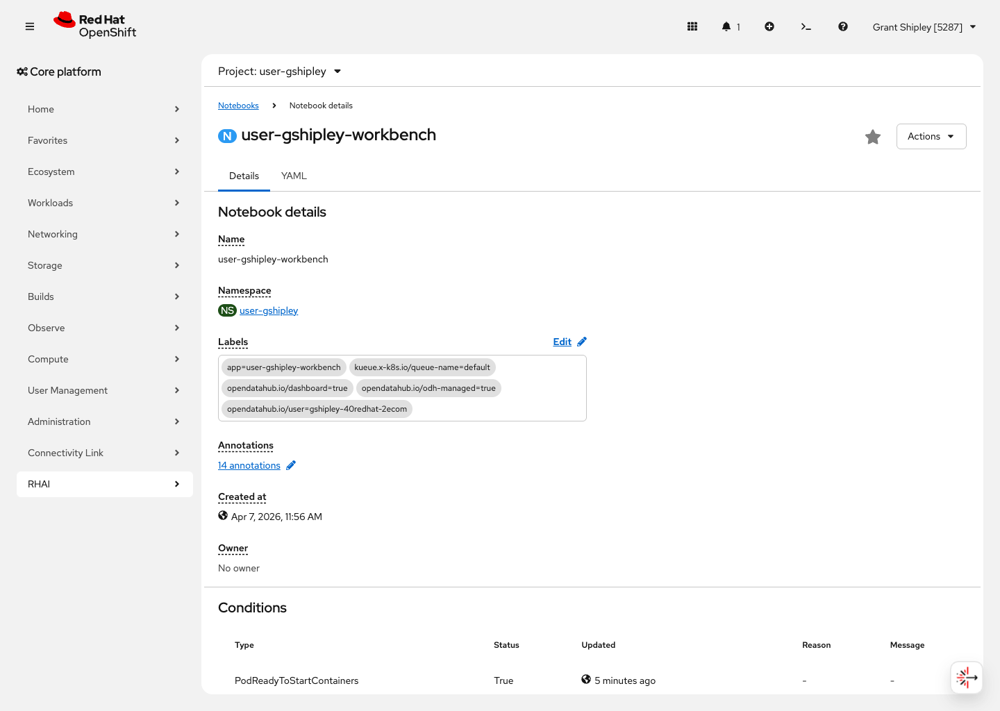

# OpenShift AI 3.3 Workbench Basics

Explore an existing Red Hat OpenShift AI 3.3 workbench through the OpenShift console, using real screenshots from the target cluster.

## Audience

- Platform engineers, solution architects, technical sellers, or workshop facilitators demonstrating `rhai-3.3`.

## Objectives

- Access Red Hat OpenShift AI from the OpenShift console.
- Open the `user-gshipley` project in the OpenShift console.
- Review the Notebook resources that back OpenShift AI workbenches in this environment.
- Verify that `user-gshipley-workbench` is present and ready for hands-on use.
- Back the lab guide with real screenshots from the target environment.

## Prerequisites

- Access to a non-production environment for `rhai-3.3`.
- A demo user with the right permissions.
- A working `playwright-cli` installation and saved auth state when needed.
- The workshop configuration file at `capture/workshop-config.toml` filled in with the target environment values.

## Environment

- Product: `rhai-3.3`
- Config file: `capture/workshop-config.toml`
- Auth state file: `capture/auth-state.json`

The configuration file defines:

- `console_origin`
- `console_url`
- `ds_project`
- `workbench_name`
- `session`
- `auth_state_file`

This cluster exposes a custom `RHAI` navigation section, but the workbench flow captured for this workshop is grounded in the OpenShift console project and Notebook resource views.

## Lab Steps

### 1. Access the environment

Log in to the OpenShift console and confirm that the OpenShift AI entry point is available for the demo user.

Expected result:
- The learner reaches the OpenShift console home or landing page.
- The console clearly shows the navigation entry into Red Hat OpenShift AI.

### 2. Open the project overview

Open the `user-gshipley` project overview in the OpenShift console.

Expected result:
- The learner sees the `Project details` section for `user-gshipley`.
- The page confirms the project is active and available.

### 3. Review the Notebook inventory

Open the `Notebooks` resource in the `user-gshipley` namespace and confirm that the workbench inventory is visible.

Expected result:
- The learner sees the `Notebooks` page.
- The list shows `user-gshipley-workbench`.

### 4. Inspect the workbench details

Open `user-gshipley-workbench` and inspect the Notebook details page.

Expected result:
- The learner sees the Notebook details for `user-gshipley-workbench`.
- The readiness conditions show a healthy state, including `Ready=True`.

## Validation

- The learner can reach Red Hat OpenShift AI from the OpenShift console.
- The learner can open the `user-gshipley` project.
- The learner can locate `user-gshipley-workbench` in the Notebook list.
- The Notebook details page shows a healthy ready condition for the workbench.
- The final console state matches the captured screenshots.

## Cleanup

- No cleanup is required if this workshop is run in read-only mode.
- If you create additional demo resources while extending the workshop, remove them after validation.
- Remove any temporary demo assets created during validation.
