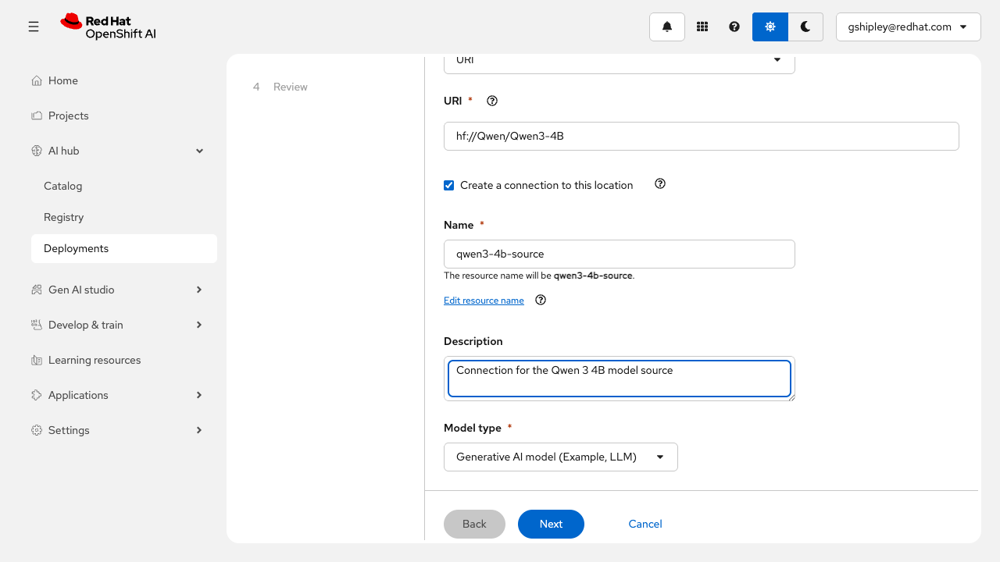
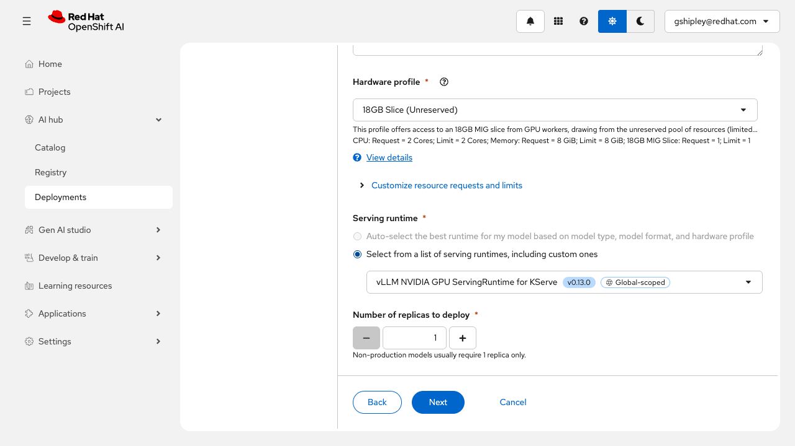
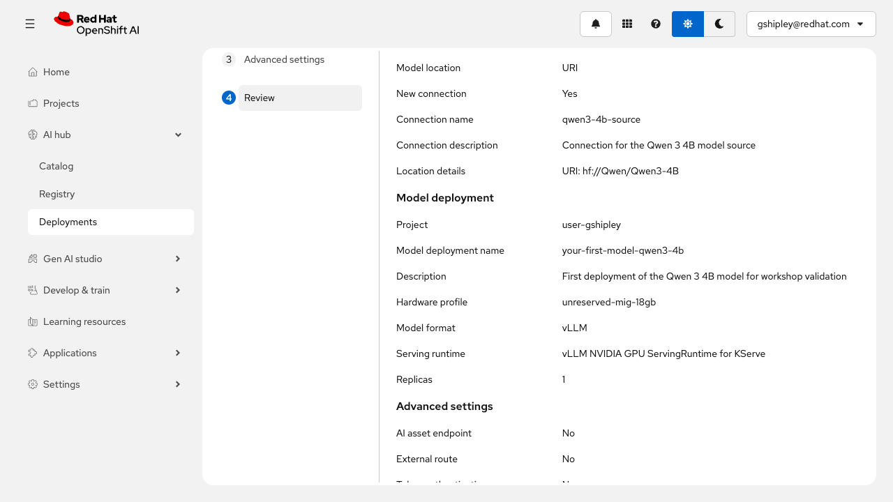
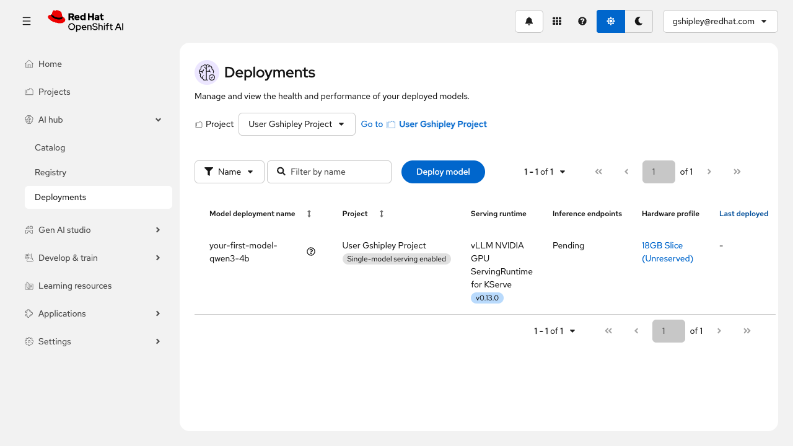

# Your first Model

Deploy the Qwen 3 4B model from Hugging Face by using OpenShift AI model serving and a GPU-backed vLLM runtime.

## Audience

- Platform engineers learning the OpenShift AI deployment workflow.
- Solution architects who want a short model-serving walkthrough.
- Technical sellers or workshop facilitators preparing a first live demo.

## Estimated Time

- 15 minutes

## Objectives

- Start from an OpenShift AI project and open the model deployment flow.
- Deploy the Qwen 3 4B model from Hugging Face by using a URI-based source.
- Choose a compatible GPU hardware profile and the NVIDIA vLLM serving runtime.
- Submit the deployment and verify that the model enters the deployment list.

## Prerequisites

- Access to a non-production environment for `rhai-3.3`.
- A user who can access the OpenShift AI dashboard and deploy models in the target project.
- Access to at least one compatible GPU hardware profile for model serving.
- Outbound connectivity from the cluster to the Hugging Face model source, or an equivalent mirrored source if your environment is restricted.
- Workshop configuration in `capture/workshop-config.toml`.

## Environment

- Product: `rhai-3.3`
- Dashboard URL: `https://data-science-gateway.apps.ocp.cloud.rhai-tmm.dev/`
- Project: `User Gshipley Project` (`user-gshipley`)
- Model: `Qwen 3 4B`
- Model URI: `hf://Qwen/Qwen3-4B`
- Hardware profile: `18GB Slice (Unreserved)`
- Serving runtime: `vLLM NVIDIA GPU ServingRuntime for KServe`
- Config file: `capture/workshop-config.toml`
- Capture session: `pw-1st-model`

## Lab Steps

### 1. Open the target project and orient on the Overview page (2 minutes)

Open the OpenShift AI dashboard and go to `User Gshipley Project`. Stay on the `Overview` tab first so you can confirm that you are in the correct project and see the core tabs that define the project workspace.

The overview page is useful because it establishes the overall project layout before you start deploying anything. From here, scroll down to the `Serve models` section. In this environment, that section confirms that single-model serving is enabled and provides the `Deploy model` action that opens the guided wizard.

The purpose of this first step is orientation. Before you start filling forms, make sure you understand which project you are deploying into and where OpenShift AI surfaces model-serving actions on the project overview page.

Expected result: you can identify the correct project and know that the `Deploy model` action is available further down in the `Serve models` section of the overview page.

### 2. Enter the model source details (3 minutes)

Click `Deploy model`. On the `Model details` step, configure the source of the model:

- Set `Model location` to `URI`.
- Enter `hf://Qwen/Qwen3-4B` as the model URI.
- Leave `Create a connection to this location` enabled.
- Set the connection name to `qwen3-4b-source`.
- Set `Model type` to `Generative AI model (Example, LLM)`.

This step tells OpenShift AI where the model artifacts live and what kind of serving workflow to prepare. Using a Hugging Face URI keeps the workshop focused and avoids pre-loading a custom model catalog.

Expected result: the wizard accepts the Qwen URI and enables the next step.

### 3. Configure the deployment (4 minutes)

Move to the `Model deployment` step and provide the deployment settings:

- Select `User Gshipley Project` as the target project.
- Set the model deployment name to `your-first-model-qwen3-4b`.
- Choose the `18GB Slice (Unreserved)` hardware profile.
- Choose `vLLM NVIDIA GPU ServingRuntime for KServe`.
- Keep the number of replicas at `1`.

This is the most important configuration step in the workshop because this is where you translate "a model in a repository" into "a model that can answer requests." Qwen 3 4B is a generative language model. The `4B` in the name means the model has roughly four billion parameters, which are the learned numeric weights the model uses to predict the next token in a response. In practical terms, that makes this a real large language model, but still small enough to fit into a short workshop and a modest GPU-backed serving profile.

It also helps to understand what you are building here. You are not launching a notebook or opening a chat UI. You are creating a model-serving deployment: an inference service that loads the model, keeps it available in memory, and exposes an endpoint that applications can call. OpenShift AI handles the plumbing, but you still need to choose where the model runs and which runtime will serve it.

Each field in this step has a clear purpose:

- The project determines where OpenShift AI creates the deployment and related serving resources.
- The deployment name gives you a stable way to identify this model in the dashboard and through APIs.
- The hardware profile determines how much accelerator capacity is available to load the model and generate tokens.
- The serving runtime determines which software stack is responsible for loading the model and answering inference requests.
- The replica count determines how many copies of the serving pod are created.

For a 4B parameter model, the `18GB Slice (Unreserved)` profile is a practical workshop-sized choice because it gives the model access to GPU resources without requiring an entire large accelerator for a first lab. The `vLLM NVIDIA GPU ServingRuntime for KServe` option is a strong fit for large language models because it is designed for efficient text generation workloads on NVIDIA GPUs. Keeping the replica count at `1` also keeps the deployment simple and limits resource consumption while you learn the flow.

Expected result: the deployment form validates and allows you to continue to the next step.

### 4. Review and submit the deployment (3 minutes)

Keep the default `Advanced settings` values unless your environment requires an external route or token authentication. Move to the `Review` step and confirm the final configuration:

- Model type: `Generative AI model`
- Model URI: `hf://Qwen/Qwen3-4B`
- Project: `user-gshipley`
- Deployment name: `your-first-model-qwen3-4b`
- Hardware profile: `18GB Slice (Unreserved)`
- Serving runtime: `vLLM NVIDIA GPU ServingRuntime for KServe`

The review screen is the final chance to catch mistakes before OpenShift AI creates the model-serving resources. Once everything looks correct, click `Deploy model`.

Expected result: the deployment request is accepted and you are returned to the `Deployments` page for the project.

### 5. Verify the deployment request (3 minutes)

On the `Deployments` page, find `your-first-model-qwen3-4b`. In this environment, the model enters the list immediately and then moves through its startup lifecycle.

The first useful checkpoint is that the deployment appears with the correct project, serving runtime, and hardware profile. Depending on image pull time, model download time, and GPU availability, the deployment can spend some time in an initial startup phase before eventually moving to a steady-state status such as `Running`.

For a short first workshop, seeing the deployment enter the list with the expected configuration is enough to validate that the serving workflow succeeded.

Expected result: the Qwen deployment appears on the `Deployments` page with the expected project, runtime, and hardware profile.

## Validation

- The learner can open the deployment wizard from the project overview.
- The learner can enter `hf://Qwen/Qwen3-4B` as the model source.
- The learner can select a compatible GPU hardware profile and the NVIDIA vLLM serving runtime.
- The learner can submit the deployment.
- The learner can verify that `your-first-model-qwen3-4b` appears in the deployment list.

## Cleanup

- Stop or delete `your-first-model-qwen3-4b` after the lab if you do not want to continue consuming GPU-backed resources.
- Remove the `qwen3-4b-source` connection if it was created only for this workshop.
